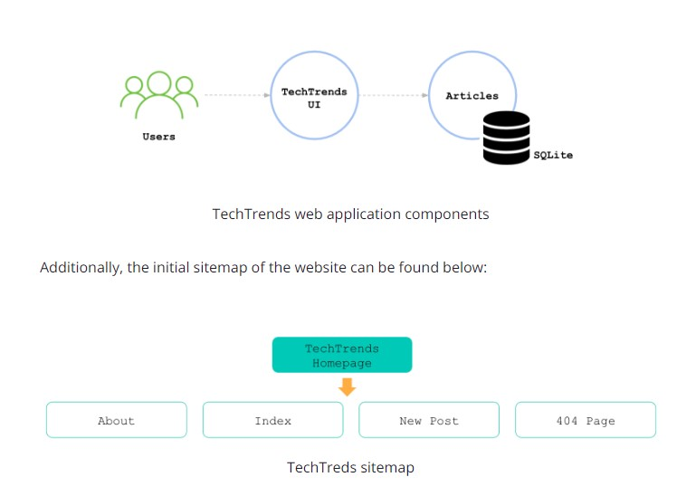

# techtrends_nanodegree_Project4

# Overview
TechTrends is an online website used as a news sharing platform, that enables consumers to access the latest news within the cloud-native ecosystem. In addition to accessing the available articles, readers are able to create new media articles and share them.

To run this application follow these steps:

1. Initialize the database by using the python init_db.py command. This creates or overwrites (if the file already exists) the database.db file that is used to store and access the available posts.
2. Run the TechTrends application by using the python app.py command. The application is running on port 3111 and you can access it by querying the http://127.0.0.1:3111/ endpoint.

# Dependencies
Make sure you have the following dependencies installed:
1. Install Python using the official Python document https://www.python.org/downloads/
2. Install Git using the using the instruction provided in the document https://git-scm.com/downloads
3. Install Docker using the using the instruction provided in the document https://docs.docker.com/get-docker/
4. Install Vagrant using the using the instruction provided in the document https://www.vagrantup.com/downloads
5. Install VirtualBox using the using the instruction provided in the document https://www.virtualbox.org/wiki/Downloads. Ensure that you have VirtualBox 6.1.16 or higher installed.

# Step 1: Best Practices For Application Deployment
Throughout this step, you should apply some of the learned best development practices to the TechTrends project. As a result, you will add the metrics and health check endpoints, in addition to the logging functionality.

1. Check the Python installation and clone the https://github.com/sanjidat/techtrends_nanodegree_Project4.git repository
2. python3 --version  (To Check the Python version installed)
3. cd techtrends_nanodegree_Project4/techtrends/
4. run "python app.py"
<h3>Healthcheck endpoint</h3>
Navigate to http://127.0.0.1:3111/healthz in the browser and look for the output "result: OK - healthy"
<h3>Metrics endpoint</h3>
Navigate to http://127.0.0.1:3111/metrics in the browser and look for the output "{"db_connection_count": 1, "post_count": 7}"
<h3>Logs</h3>
Check for the log output.

# Docker for Application Packaging
For Docker,
## Docker Login
docker login
## Docker commands used to build the application 
docker build -t techtrends .
## Docker commands used to run the application
docker run -d -p 7111:3111 techtrends
## Docker commands used to get the application logs
docker logs ff7dc67311ab54e085148d062a8b953d99aa2b973defc19b9ad9edc311991d16
## Docker command to tag the image
docker tag techtrends gohin/project4_techtrend:v1.0.0
## Docker command to push to Docker Repo
docker push gohin/project4_techtrend:v1.0.0

